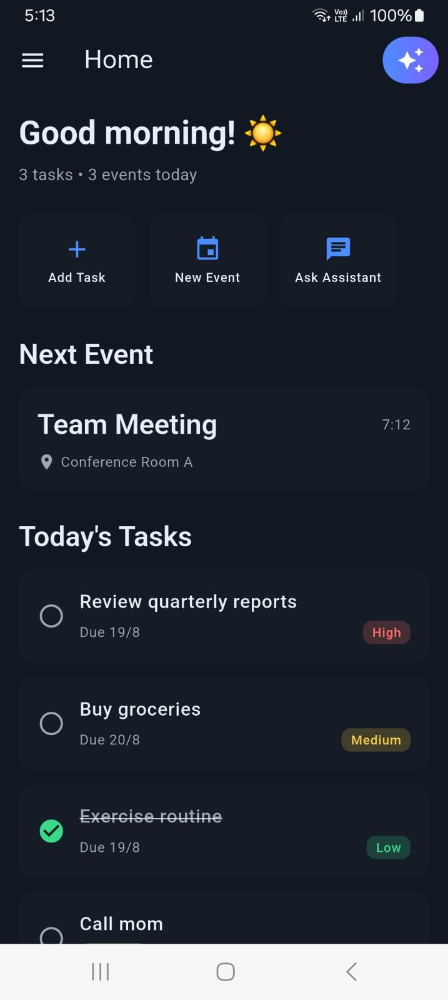
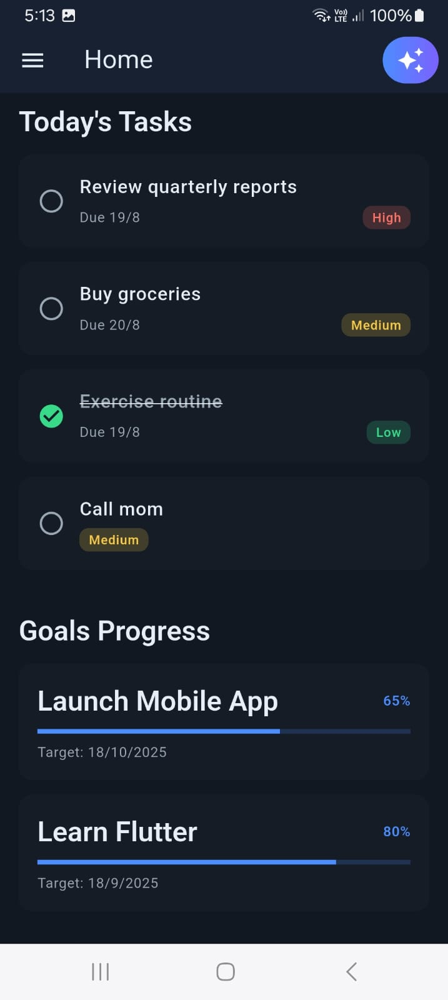
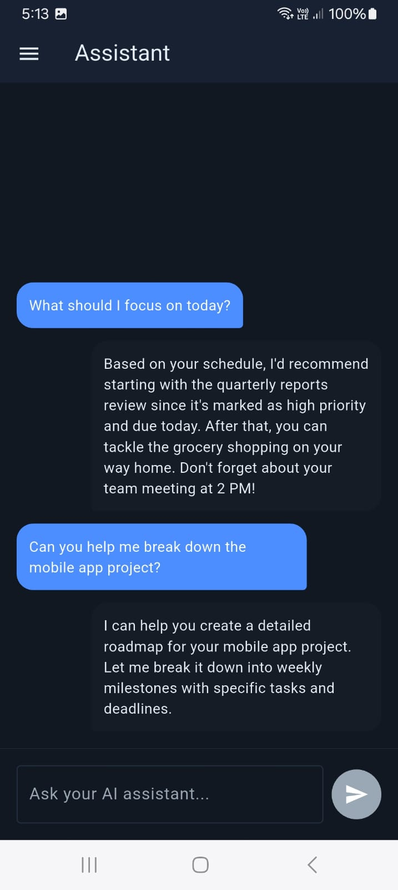
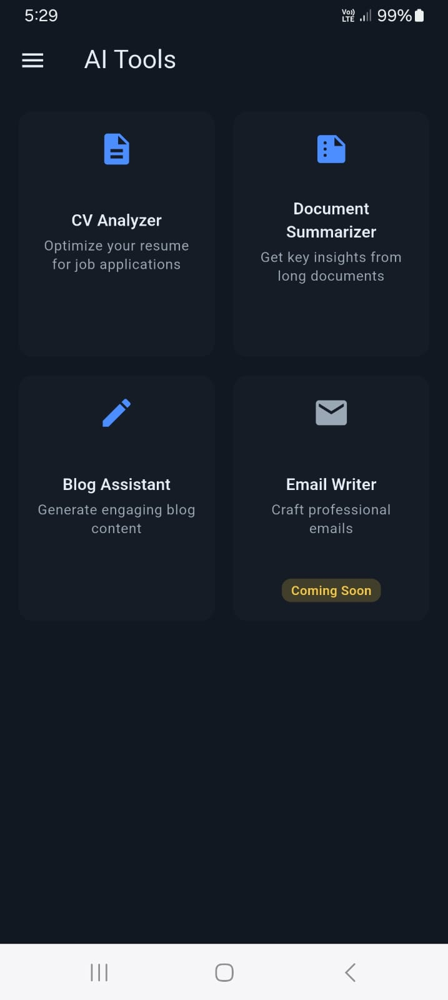
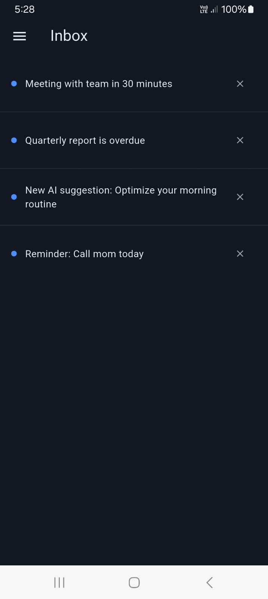
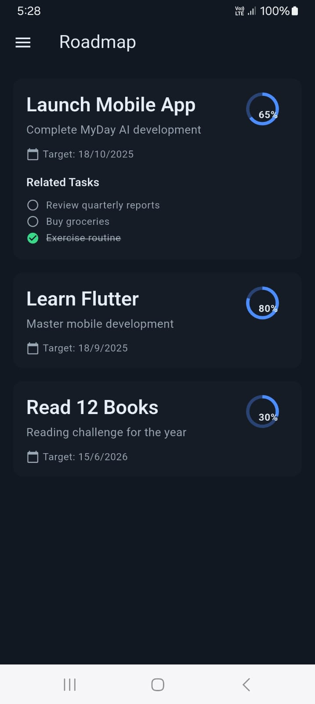
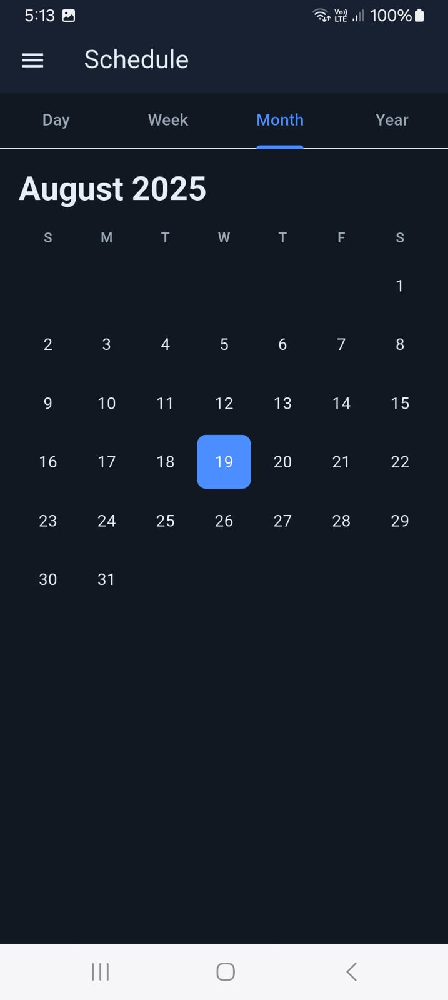
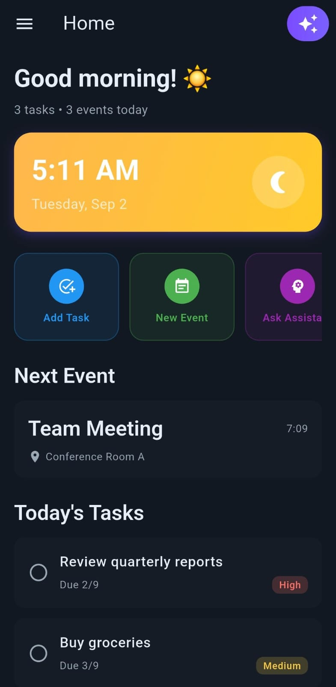
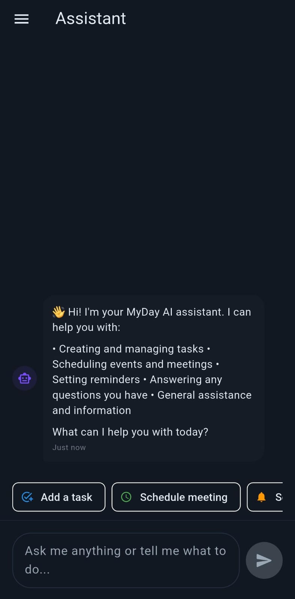
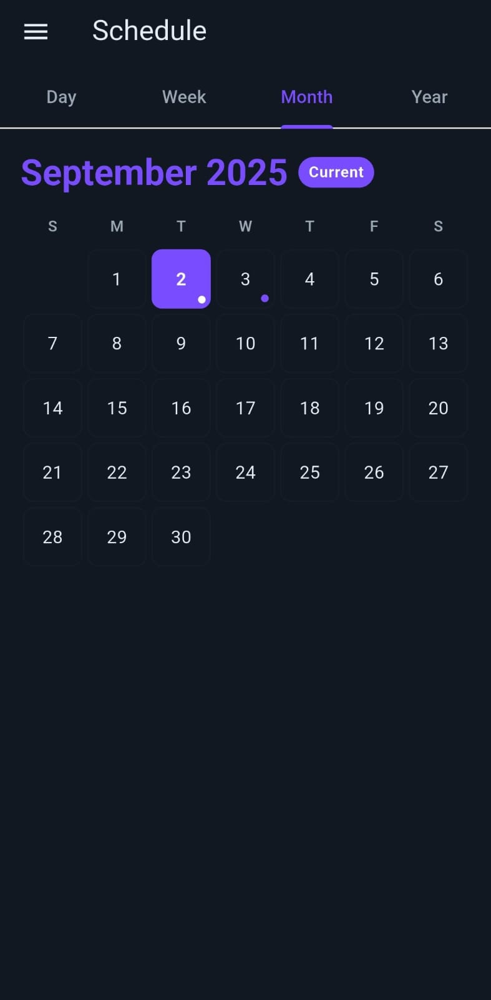

# MyDay AI App (Demo)

**MyDay AI** is an AI-powered personal assistant app built with Flutter.  
This public repo is a **showcase** with screenshots and project details.  
👉 The full source code is kept private while the app is under development.

---

## Features
- Home dashboard with tasks & events  
- AI-powered assistant  
- Smart calendar & schedule  
- Inbox & notifications  
- Custom settings  

---

## Screenshots

### v1 (Old Version)

  
  
  
  
  
  
  

---

### v2 (Latest Version)

  
  
  

---

## Tech Stack
- **Flutter (Dart)**
- Android & iOS
- Custom UI/UX design

---

## Author
**Moustafa Mohamed**  
- [LinkedIn](https://www.linkedin.com/in/moustafamohamed01/)  
- [Kaggle](https://www.kaggle.com/moustafamohamed01)  
- [GitHub](https://github.com/MoustafaMohamed01)

---

⚠️ **Note:** MyDay AI is currently in development.  
This repo is a showcase of its **design and concept** while the app is being built.
